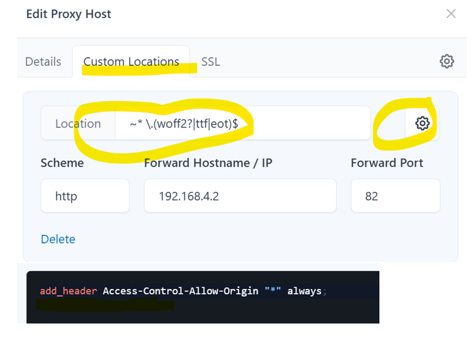
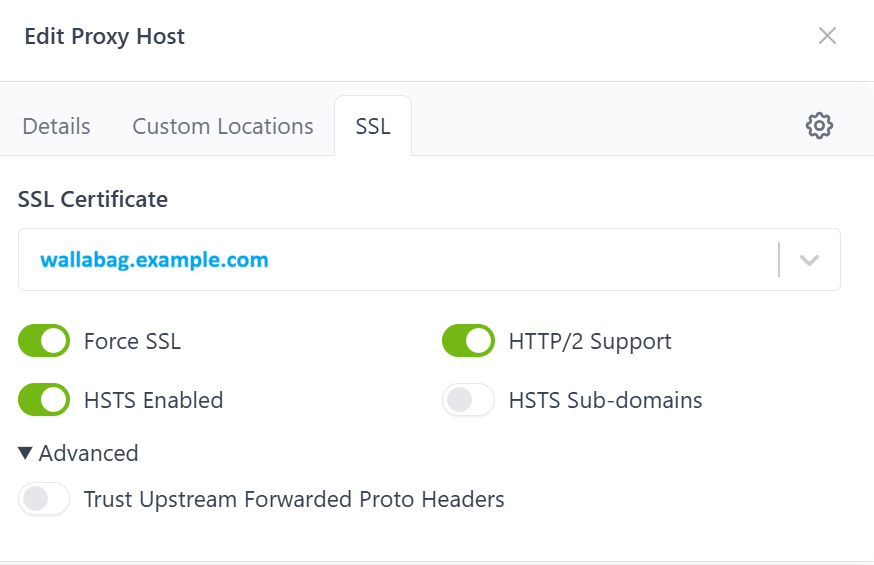

# Home Assistant App/Add-on: Wallabag

Wallabag app (earlier 'add-on') for Home Assistant (HA) - a web application allowing you to save web pages for later reading. Similar to Instapaper, ReadLater self-hosted functionality. Click, save and read it when you want.


- Further information can be found at https://wallabag.org
- Install details: https://github.com/banditto9/addon-wallabag/blob/main/wallabag/DOCS.md

**Please note that Home Assistant always installs whatever is on the main branch. "Releases" are for a history of tagged, known-working states.**

##
**(!)For clean installations - onetime DB manual steps required:**

This app/add-on uses MariaDB (MySQL) for storing data (MariaDB and phpmyadmin apps/add-ons should be installed to run this app/add-on accordingly)

1) MariaDB requires manual user creation (with some password) - easy to do via 'phpmyadmin' separate app (add-on). Earlier automated DB setup under 'service' account doesn't work anymore, freshly installed app/add-on simply can't be started without connection to DB.
2) Then create 'wallabag' db in phpmyadmin (database_charset: utf8mb4 for emoji support and more wider charset support during import)
3) Add priviliges for the created user to the 'wallabag' DB.
4) Connect to the created wallabag DB with the created user as a 'remote connection'.

**Some tips&notes:**
- SSL cert (if exposed to the Internet) is easier to handle via NGINX Proxy Manager (NPM).
- I have exposed the app and my settings are as follows below, SSL forced https is managed by NPM (&port forward on router) so SSL is false here.
- Deletion of Wallabag app/add-on doesn't touch the DB data. You can reinstall the app/add-on and use the existing wallabag db later if required.
- Once you have migrated to Wallabag 2.6.14 you won't be able to access DB with earlier versions of Wallabag due to the different scheme of DB (migration will be performed by newer version). Please do DB backups (http://dev.mysql.com/doc/refman/5.7/en/backup-methods.html) from myphpadmin if you have to switch between different versions of Wallabag.
- If you delete MariaDB app (add-on) you will loose Wallabag data.
- NGINX proxy manager (if used): better to switch off cache option and restart it as sometimes proper html/css may be displayed incorrectly at first launch.
```
ssl: false
certfile: fullchain.pem
keyfile: privkey.pem
twofactor_auth: false
anyone_can_register: false
locale: en
fosuser_confirmation: true
app_url: https://wallabag.example.com
remote_mysql_host: core-mariadb
remote_mysql_database: wallabag
remote_mysql_username: wallabag
remote_mysql_password: changemenow
remote_mysql_port: 3306
```

**NGINX Proxy Manager settings for both local (http) and external (https) connections:**

When you plan to use the wallabag both with http/https the following settings may be required due to the CORS issue as wallbag uses one specified URL which is usually https. By doing settings similar to the following ones may help you to overcome CORS issue and use wallabag both locally and externally.

<details>

<summary>📷 Click to show screenshots</summary>




</details>


## Authors

- The original setup of this HA app/add-on was done by Paulo Costa https://github.com/coostax/addon-wallabag
- Wallabag repo: https://github.com/wallabag/wallabag

## Environment versions:
- Wallabag: 2.6.14 (current as per August 2026)
- Base image 9.4.0 (Debian 13 trixie)
- PHP 8.3
- Node.js 2x
